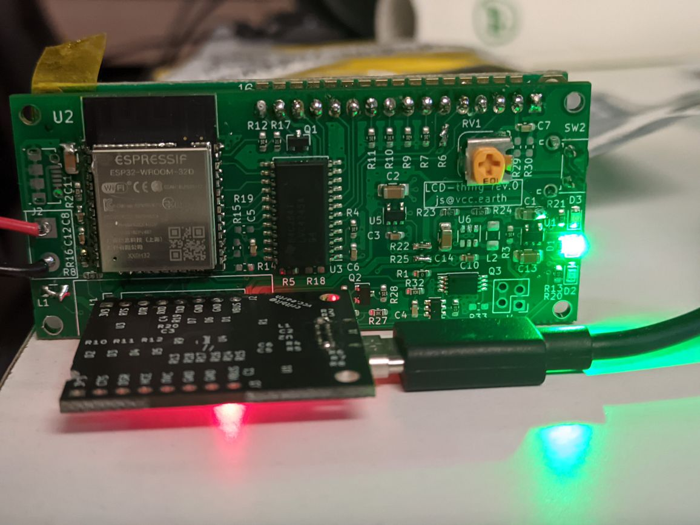

## Firmware for an LCD device.

I have a lot HD44780 LCDs. I need to use them. Work in progress, pls no judge me.

Dedicated for hardware platform:

https://github.com/cr1tbit/LCD-thing

If the Homie library throws some errors, add `#include <vector>` in HomieNode.h

For info about secrets generation - see:

https://github.com/hspsh/cookie-pio-iot/tree/main/%7B%7B%20cookiecutter.project_slug%20%7D%7D

### Serial monitoring issues

If monitoring keeps the target in reset state, manually perform DTR/RTS sequence by typing following keys in order:

CTRL + [T,D,T,R]